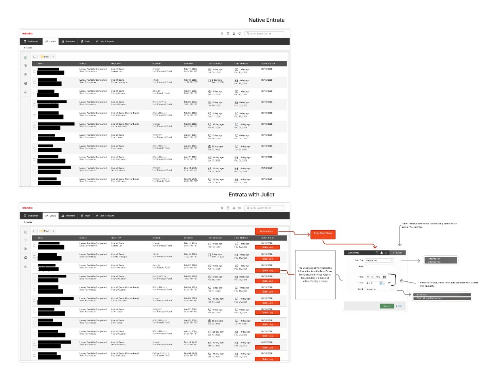
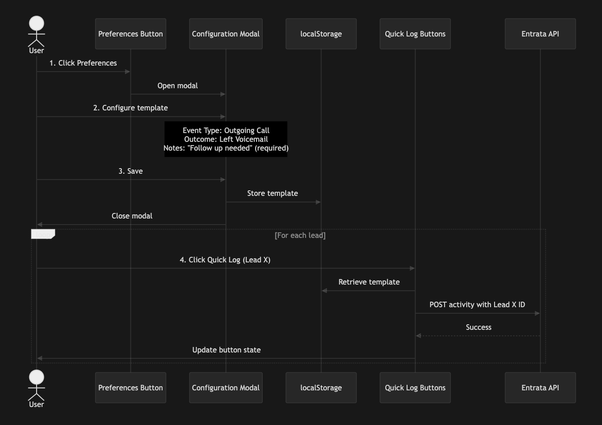

# Juliet: Entrata Workflow Optimization

> Reducing lead logging time from 30 seconds to under 5 seconds — because leasing consultants shouldn't spend their day clicking through menus.

**Impact**: 80% reduction in administrative overhead | 10 clicks → 1 click



---

## The Problem I Noticed

As a leasing consultant using Entrata CRM, I found myself repeatedly frustrated by what should have been a simple task: logging that I'd called a lead.

Every single time, the same tedious workflow:
1. Navigate to the lead's profile (3 clicks)
2. Find the "Activities" tab (2 clicks)
3. Click "Add Activity" (1 click)
4. Select activity type from dropdown (2 clicks)
5. Fill out the form (typing + 1 click)
6. Submit (1 click)
7. Navigate back to the leads page (2 clicks)

**Total: 10+ clicks and ~30 seconds of non-productive time.**

When you're managing 50+ leads per day, this "friction tax" adds up to **25 minutes of pure administrative overhead** — time that could be spent actually talking to prospects.

## The Root Cause

The inefficiency stems from three core UX problems:

1. **Navigation Fatigue**: The CRM forces users to leave the Leads page to log activities
2. **Context Switching**: Bouncing between pages creates cognitive load and breaks workflow
3. **Repetitive Data Entry**: Most call attempts follow the same pattern, yet every field must be manually filled

This isn't a training issue or a user error — it's a fundamental workflow design flaw.

## The Solution

Juliet redesigns the logging workflow around **two key insights**:

### 1. Configuration Should Happen Once
Most leasing consultants make similar types of calls in batches. If I'm making 20 outbound calls and leaving voicemails, why configure the same activity template 20 times?

**Juliet's approach:** Configure your activity template once via a Preferences modal, then reuse it across all leads.

### 2. Execution Should Be One-Click
Once configured, logging an activity should be as simple as clicking a button next to the lead's name.

**Juliet's approach:** Inject "Quick Log" buttons directly into the Leads table. One click = activity logged.



## How It Works

### Phase 1: One-Time Setup
```
User clicks Preferences → Configures template → Saves
```
- Select event type (e.g., "Outgoing Call")
- Choose call outcome (Connected, Left Voicemail, No Answer, Wrong Number)
- Add notes (required by Entrata API)
- Configuration persists across sessions via localStorage

### Phase 2: Rapid Execution
```
User clicks Quick Log → Activity logged → Button updates
```
- Single click per lead
- Asynchronous API call (no page reload)
- Immediate visual feedback
- No navigation away from Leads page

## Technical Approach

**Platform:** Browser-side JavaScript injection via [Tampermonkey](https://www.tampermonkey.net/)

**Why Tampermonkey?**
- No backend required — runs entirely in the browser
- Works with existing Entrata installation
- Easy to install and update
- Zero impact on CRM performance

**Key Technical Challenges:**
1. **API Reverse Engineering**: Capturing Entrata's activity logging endpoints and payload structure
2. **DOM Manipulation**: Injecting UI elements into a third-party application without breaking existing functionality
3. **State Management**: Persisting user preferences across sessions using localStorage
4. **Error Handling**: Gracefully managing API failures and providing clear user feedback

## Impact & Metrics

### Before Juliet
- **Time per lead**: ~30 seconds
- **Clicks required**: 10+
- **Daily overhead** (50 leads): ~25 minutes
- **User experience**: Frustrating, repetitive

### After Juliet
- **Time per lead**: <5 seconds (after initial setup)
- **Clicks required**: 1
- **Daily overhead** (50 leads): ~4 minutes
- **User experience**: Seamless, efficient

**Result: 84% reduction in administrative time**

## What I Learned

### Product Thinking
- **Observe actual workflows**: The best product ideas come from watching real users struggle
- **Question assumptions**: Just because a CRM is "enterprise-grade" doesn't mean its UX is optimal
- **Measure impact**: Quantifying the problem (30s → 5s, 10 clicks → 1) makes the solution compelling

### Technical Skills
- **API reverse engineering**: Used browser DevTools to capture and replicate API requests
- **DOM manipulation**: Learned to inject UI elements into third-party applications safely
- **User research**: Validated the problem with other leasing consultants before building

### Documentation
- **PRD structure**: Created a formal Product Requirements Document with acceptance criteria
- **Visual communication**: Used mockups and sequence diagrams to clarify complex workflows
- **Iterative thinking**: Planned MVP (required notes) vs. future enhancements (smart defaults)

## Project Status

### ✅ Completed
- Problem validation and user research
- Product Requirements Document with detailed acceptance criteria
- UI/UX mockups
- Workflow sequence diagrams
- Repository structure and documentation

### 🚧 In Progress
- Tampermonkey script implementation
- API endpoint discovery and testing
- localStorage state management

### 📋 Roadmap
- **P2**: Smart default values for notes field (reduce typing even further)
- **P2**: Bulk activity logging (use Entrata's native checkboxes for mass actions)
- **P3**: Hover-to-preview (show lead summary on hover for quick context)

## Repository Structure

```
juliet-v1/
├── README.md              # You are here
├── docs/
│   ├── PRD.md            # Full Product Requirements Document
│   └── assets/           # Mockups and screenshots
├── src/
│   └── (coming soon)     # Tampermonkey userscript
└── .gitignore            # Git ignore rules
```

## Getting Started

**Coming soon**: Installation instructions for the Tampermonkey script once implementation is complete.

For now, check out the [Product Requirements Document](docs/PRD.md) to see the detailed planning and specifications.

## About

This project was born from real frustration with inefficient enterprise software. I believe that good software should respect users' time and intelligence — and when it doesn't, there's an opportunity to build something better.

**Status**: Active development  
**License**: MIT (coming soon)  
**Questions?** Open an issue or reach out!

---

*"The best time to save is the time you don't waste." — Juliet*
