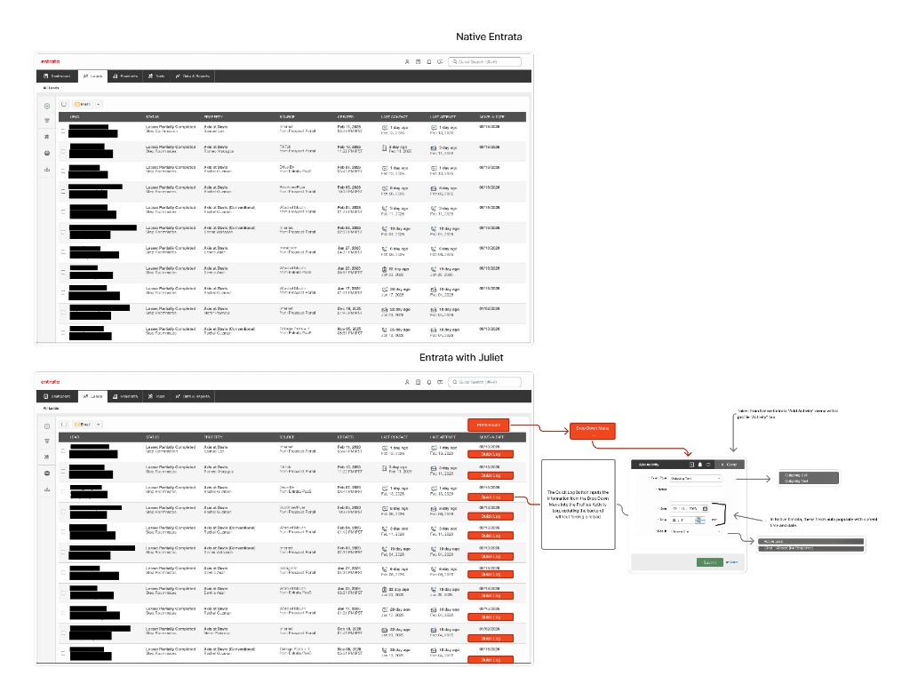
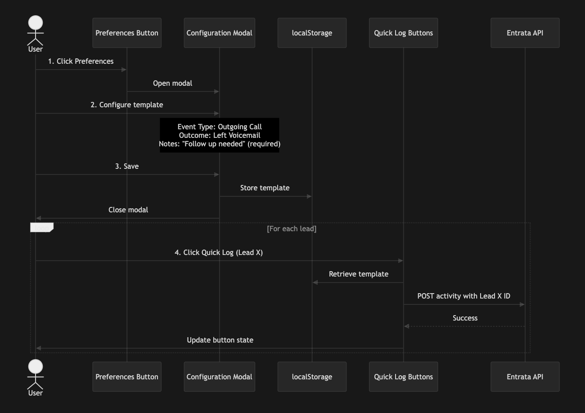

# Juliet: Entrata Leads Hub

> Log activities, send texts, and place calls from the Entrata Leads page — without the menu maze or constant tab-hopping.

**Logging impact** (after setup): ~96% less time vs. the native activity flow | 10+ clicks → 1 click (or Cmd+click for instant log)

Text and call efficiency targets are defined in the [PRD](docs/PRD.md) (KPI 2–3).



---

## The Problem I Noticed

As a leasing consultant using Entrata CRM, simple outbound work was buried under navigation and fragmented tools.

**Logging a call** meant leaving the Leads view every time:
1. Navigate to the lead's profile (3 clicks)
2. Find the "Activities" tab (2 clicks)
3. Click "Add Activity" (1 click)
4. Select activity type from dropdown (2 clicks)
5. Fill out the form (typing + 1 click)
6. Submit (1 click)
7. Navigate back to the leads page (2 clicks)

**Total: 10+ clicks and ~30 seconds** of non-productive time per log.

**Texting** (Heymarket) and **calling** (Courtesy Connection) meant additional context switches — new tabs, copy-paste phone numbers, and broken rhythm on the Leads page.

When you're managing 50+ leads per day, that friction adds up to a large **administrative tax** — time better spent talking to prospects.

## The Root Cause

1. **Navigation fatigue**: The CRM pushes you off the Leads page for core actions.
2. **Fragmented tooling**: Log, text, and call live in different products and flows.
3. **Repetitive setup**: The same templates and outcomes get re-entered over and over.

This is a workflow design problem, not a training problem.

## The Solution

Juliet turns the Leads table into a **single interaction surface**:

### 1. Configure once
- **Log** (blue preferences): event type, outcome, notes template — saved for reuse.
- **Text** (yellow preferences): default message + Heymarket connection — use **Login to Heymarket** for auto-captured credentials, or **Advanced** for manual token / team / inbox (see [PRD](docs/PRD.md) FR-6). Outbound texts use a **FIFO send queue**; each send waits **2 seconds** after you trigger it (before any Heymarket API calls) to reduce bot-flag risk, and only one send runs at a time (see FR-7).
- **Call**: Courtesy Connection credentials configured once in-script.

**Switching Heymarket accounts:** The login popup uses your browser’s existing Heymarket session. To use a different account, sign **out** inside the Heymarket popup (or clear site data for `app.heymarket.com`), then sign in as the other user and wait for auto-capture—or paste token, team ID, and inbox ID under **Advanced** and save. Juliet stores credentials in both Tampermonkey **`GM_*` storage** and **`localStorage`** (`juliet_heymarket_config`); if values look stuck after editing one place, clear both or save again from the Text settings modal.

### 2. Act from each row
Each lead row gets three color-coded actions: **call** (green), **text** (yellow), **log** (blue).

- **Log & text — dual mode**: Normal click opens a pre-filled modal to review and submit. **Hold Cmd (⌘) and click** to send immediately using the saved template (button styling shows quick mode).
- **Call**: One click initiates the outbound call via Courtesy Connection — no modal.



## How It Works

### Setup (once per machine / session needs)
- Save log and text templates; complete Heymarket bootstrap or Advanced fields; save Courtesy Connection settings as implemented in the userscript.
- Preferences persist via **localStorage** (and Tampermonkey **GM_** storage where used for cross-tab bootstrap data).

### Execution (every lead)
- **Log / text**: modal path or **Cmd+click** instant path.
- **Call**: direct API trigger from the row.
- Requests are **asynchronous** — no full-page reload; buttons show success or error state.

## Technical Approach

**Platform:** [Tampermonkey](https://www.tampermonkey.net/) userscript — [src/entrata-quick-log.user.js](src/entrata-quick-log.user.js) (v0.7.0).

**Why Tampermonkey + privileged APIs?**
- No dedicated backend — logic runs in the browser.
- **`GM_xmlhttpRequest`** and **`@connect`** allowlists reach **Entrata**, **Heymarket**, and **Courtesy Connection** APIs from the extension context (ordinary page fetch would be blocked by CORS).
- **`@match`** includes Entrata, Heymarket, and Courtesy Connection origins so bootstrap / capture flows can run where those apps load.

**Challenges addressed:**
1. **API reverse engineering** — Entrata activity payloads, Heymarket compliance + send, Courtesy Connection call endpoint.
2. **DOM injection** — Per-row controls without breaking Entrata layout.
3. **State** — Templates and credentials in localStorage / GM storage; Cmd-key listeners for quick-mode UI.
4. **Errors** — Failed requests surface on the button without breaking the table.

## Impact & Metrics

### Activity logging (measured narrative — native Entrata flow vs. Juliet after setup)

| | Before | After (Juliet) |
|--|--------|----------------|
| Time per log | ~30 s | ~1 s |
| Clicks | 10+ | 1 (or Cmd+click) |
| Daily overhead @ 50 logs | ~25 min | ~4 min |

That is roughly **96% less time per log** and **~84% less daily overhead** for that slice alone.

### Text & call
Targets (e.g. time-to-text, time-to-call) and acceptance criteria are in [docs/PRD.md](docs/PRD.md) §3 and §5 — Juliet implements the integrated flows; treat those KPIs as product goals unless you have your own measurements.

## What I Learned

### Product Thinking
- **Observe actual workflows**: The best ideas come from watching real users struggle.
- **Question assumptions**: Enterprise CRMs are not guaranteed to be workflow-optimal.
- **Measure where you can**: Logging math (30s → ~1s, many clicks → one) makes the pain tangible.

### Technical Skills
- **API reverse engineering** — DevTools and replay for multiple vendors.
- **DOM injection** — Safe UI inside a third-party app.
- **Cross-origin scripting** — Tampermonkey grants, `@connect`, and bootstrap tabs.

### Documentation
- **PRD** — Requirements, AC, sequence diagrams, changelog ([docs/PRD.md](docs/PRD.md)).
- **Iterative scope** — From logging MVP to full Leads hub (text + call + dual-mode).

## Project Status

**Userscript:** 0.7.0 (`@version` in [src/entrata-quick-log.user.js](src/entrata-quick-log.user.js))  
**PRD:** v2.4.0 (2026-04-15)

**Shipped capabilities** (see PRD FR-1–FR-7 for detail):
- Dual-mode **log** (modal + Cmd+click) with template prefs
- Dual-mode **text** via Heymarket (modal + Cmd+click), bootstrap login + Advanced fallback
- Direct **call** via Courtesy Connection API
- Per-row **call / text / log** buttons

**Roadmap** (PRD §9): LLM-assisted drafts, hover-to-preview, analytics — future iterations.

## Repository Structure

```
juliet-v1/
├── README.md                         # You are here
├── docs/
│   ├── PRD.md                        # Product requirements, AC, diagrams, changelog
│   ├── entrata-leads-structure.html  # Reference: Leads DOM / structure notes
│   └── assets/                       # Mockups and screenshots
├── src/
│   └── entrata-quick-log.user.js     # Tampermonkey userscript (Entrata + Heymarket + CC)
└── .gitignore
```

## Project Overview

**What it does:** Brings log, text, and call actions onto the Entrata Leads page with one-time configuration and minimal per-lead friction.

**Key artifacts:**
- [Product Requirements Document](docs/PRD.md)
- [Implementation](src/entrata-quick-log.user.js)

**Built with:** JavaScript, Tampermonkey (`GM_xmlhttpRequest`, `GM_getValue`, `GM_setValue`), localStorage, Entrata / Heymarket / Courtesy Connection integration — developed with Cursor AI.

## About

This project started from frustration with inefficient enterprise workflows. Good software should respect users' time; when it does not, there is room to build something better.

**Purpose:** Portfolio piece — product thinking plus technical execution.

---

*"What's in a name? That which we call a rose by any other name would smell as sweet."* — Juliet
