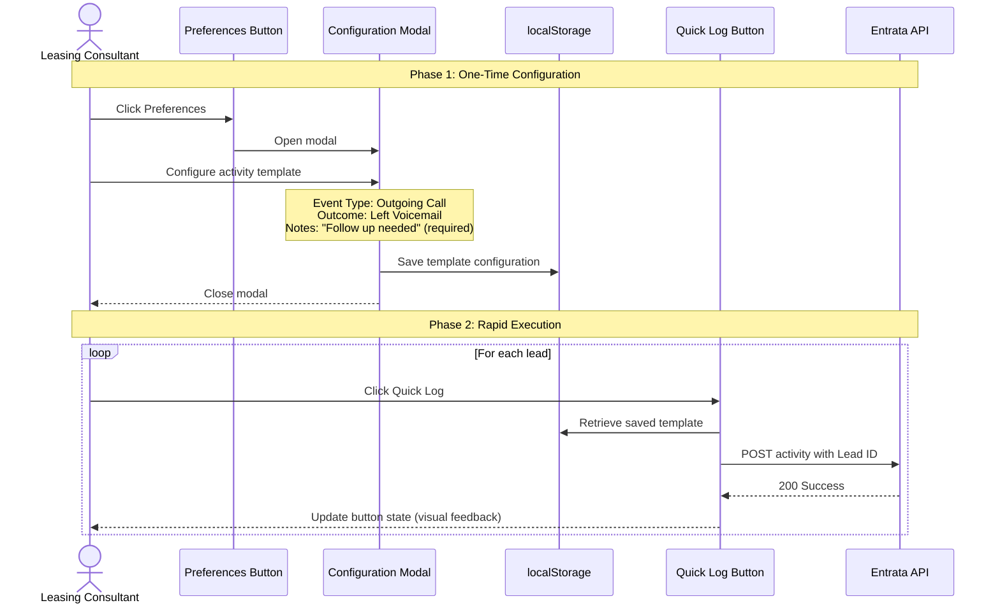

---
project: Juliet
status: draft
last_updated: 2026-02-14
version: 1.3
owner: samuel lee

---
# Entrata Workflow Optimization

## 1. Executive Summary
**Objective:** To streamline the lead-calling process within the Entrata CRM by eliminating redundant navigation and reducing administrative overhead for leasing consultants.
## 2. Problem Statement
The current Entrata lead management workflow is highly inefficient, creating a significant "friction tax" on leasing consultants.
* **Navigation Fatigue:** The process requires **10 distinct clicks** to transition from lead identification to interaction logging.
* **Latency & Overhead:** Users experience approximately **30 seconds of non-productive time** per lead due to menu transitions and page loads.
* **Context Switching:** Forcing consultants to leave the "Leads" page to log calls results in cognitive load and reduced outbound volume.
## 3. Goals & Success Metrics
* **Primary Goal:** Reduce the total time required to log a lead interaction by $80\%$.
* **KPI 1 (Efficiency):** Decrease "Time-to-Log" from ~30 seconds to <5 seconds.
* **KPI 2 (Simplicity):** Reduce "Click-Depth" from 10 clicks to 1 click.

## 4. User Story
> **As a** leasing consultant, 
> **I want to** identify, call, and log interactions directly from the Leads Page, 
> **So that** I can maximize my daily lead volume and minimize administrative downtime.

## 5. Functional Requirements & Acceptance Criteria (AC)
| ID       | Requirement              | Acceptance Criteria                                                             | Priority |
| :------- | :----------------------- | :------------------------------------------------------------------------------ | :------- |
| **FR-1** | Integrated Action Button | • Quick Log button appears in every lead row • Button is visually distinct and clearly labeled • Button remains accessible during page scrolling | P0       |
| **FR-2** | Activity Template Configuration | • Preferences button opens modal overlay • Modal contains Event Type dropdown with "Outgoing Call" option • Modal contains 4 radio buttons for call outcomes (Connected, Left Voicemail, No Answer, Wrong Number) • Modal contains required Notes textarea (must have value to save) • Modal validates that Notes field is not empty before allowing save • Template configuration persists after page reload • Modal can be closed via Cancel button or ESC key | P0       |
| **FR-3** | One-Click Activity Logging | • Single click logs activity to correct lead profile • API request completes without page navigation • Button state changes to indicate success (e.g., color change, checkmark) • Lead ID from table row is correctly captured • Failed requests display error state without breaking UI | P0       |

## 6. Technical Implementation
* **Platform:** Browser-side injection via **Tampermonkey** (JavaScript).
* **Target Environment:** Entrata CRM Leads Dashboard.
* **Methodology:** DOM manipulation to detect lead data and automate the POST request/form-fill for interaction logging.
* **Data Persistence:** User preferences stored in browser localStorage for session continuity.

## 7. Workflow Diagram

The following sequence diagram illustrates the two-phase workflow that enables rapid batch processing of lead activities:

**Key Workflow Benefits:**
* **Configuration happens once** - User sets template at start of session
* **Execution is one-click** - After setup, logging takes a single click per lead
* **No page navigation** - All interactions occur asynchronously on the Leads page
* **Immediate feedback** - Button state changes confirm successful logging
* **Persistent settings** - Template survives browser sessions via localStorage

## 8. Future Roadmap

-  **Bulk Activity Logging**
	- **Priority:** P2 (Next Milestone)
	    **Description:** Expands the tool's capability by leveraging Entrata’s native checkboxes for mass actions.
	    
- **Smart Default Values for Activity Notes**
	- **Priority:** P2 (Next Milestone)
	    **Description:** Implement intelligent default values for the Notes field based on selected call outcome (e.g., "Outbound call - Left Voicemail") to further streamline the logging process and reduce manual input requirements.
	    
- **Contextual Intelligence:** 
	- **Priority**: P3
		**Description**: Implement a "Hover-to-Preview" feature showing lead summary. 

---
## 9. Changelog
* **v1.3 (2026-02-14):** Expanded functional requirements based on UI mockup; added FR-2 (template configuration) and FR-3 (one-click logging) with detailed acceptance criteria; Notes field is required to ensure Entrata API compliance
* **v1.2 (2026-02-05):** Added formal Success Metrics, Acceptance Criteria
* **v1.1 (2026-02-03):** Outline of pain points, goals, and user stories