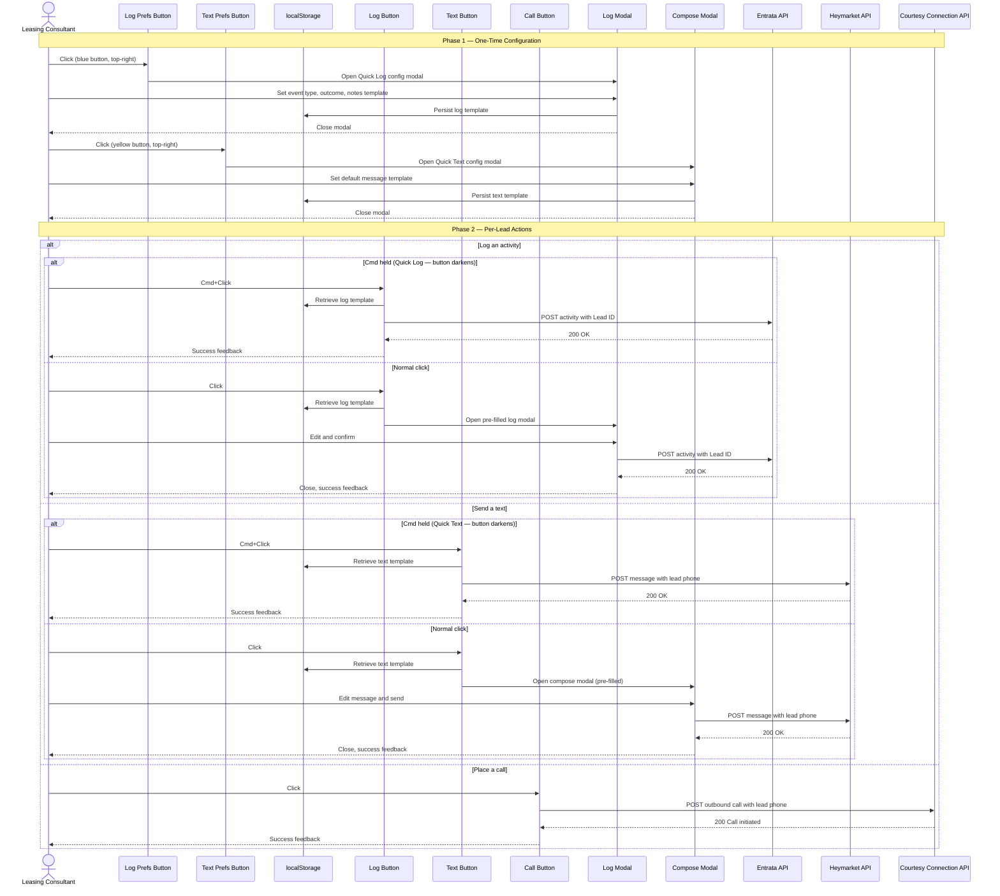

---
project: Juliet
status: active
last_updated: 2026-03-12
version: 2.1
owner: samuel lee

---
# Entrata Workflow Optimization

## 1. Executive Summary
**Objective:** To transform the Entrata CRM Leads page into a complete lead interaction hub — enabling leasing consultants to log activities, send texts via Heymarket, and place calls via Courtesy Connection without leaving the page or navigating through menus.

## 2. Problem Statement
The current Entrata lead management workflow imposes a significant "friction tax" on leasing consultants across every type of lead interaction.
* **Navigation Fatigue:** Logging a single activity requires **10 distinct clicks** and ~30 seconds of non-productive navigation time.
* **Fragmented Tooling:** Texting a lead via Heymarket and calling via Courtesy Connection each require leaving Entrata entirely, breaking consultant focus and multiplying context switches per lead.
* **Context Switching:** Every time a consultant leaves the Leads page to perform an action, cognitive load increases and outbound interaction volume drops.

## 3. Goals & Success Metrics
* **Primary Goal:** Reduce the total time and effort required for any lead interaction (log, text, call) by $80\%$.
* **KPI 1 (Log Efficiency):** Decrease "Time-to-Log" from ~30 seconds to <5 seconds.
* **KPI 2 (Text Efficiency):** Decrease "Time-to-Text" from ~45 seconds (context switch to Heymarket) to <5 seconds.
* **KPI 3 (Call Efficiency):** Decrease "Time-to-Call" from ~20 seconds (context switch to Courtesy Connection) to <5 seconds.
* **KPI 4 (Simplicity):** Reduce interaction "Click-Depth" to 1 click for all quick actions (Cmd+click mode).

## 4. User Story
> **As a** leasing consultant,
> **I want to** log activities, send texts, and place calls directly from the Leads page,
> **So that** I can complete all lead interactions without leaving the page, maximizing daily outreach volume and minimizing administrative downtime.

## 5. Functional Requirements & Acceptance Criteria (AC)
| ID       | Requirement                          | Acceptance Criteria                                                             | Priority |
| :------- | :----------------------------------- | :------------------------------------------------------------------------------ | :------- |
| **FR-1** | Dual-Mode Activity Logging           | • Normal click on `log` button opens a pre-filled log modal (event type, outcome, notes editable before submit)<br>• Cmd+click on `log` button instantly logs using saved template with no modal<br>• While Cmd key is held, `log` button changes color to signal "quick log mode" (similar to macOS Option key in Finder)<br>• API request completes without page navigation<br>• Button state changes to indicate success on completion<br>• Lead ID from table row is correctly captured<br>• Failed requests display error state without breaking UI | P0 |
| **FR-2** | Quick Log Template Configuration     | • Blue preferences button (top-right of Leads page) opens Quick Log config modal<br>• Modal contains Event Type dropdown with "Outgoing Call" option<br>• Modal contains 4 radio buttons for call outcomes (Connected, Left Voicemail, No Answer, Wrong Number)<br>• Modal contains required Notes textarea (must have value to save)<br>• Modal validates that Notes field is not empty before allowing save<br>• Template configuration persists after page reload via localStorage<br>• Modal can be closed via Cancel button or ESC key | P0 |
| **FR-3** | Heymarket Text Integration           | • Yellow preferences button (top-right) opens Quick Text config modal for setting default message template<br>• Message template persists via localStorage<br>• Normal click on `text` button opens a compose modal pre-filled with the default template (editable before send)<br>• Cmd+click on `text` button instantly sends the default template message via Heymarket API<br>• While Cmd key is held, `text` button changes color to signal "quick text mode"<br>• API request uses lead's phone number from the table row<br>• Button state changes to indicate success on send<br>• Failed requests display error state without breaking UI | P0 |
| **FR-4** | Courtesy Connection Call             | • Click `call` button immediately triggers an outbound call via Courtesy Connection API using the lead's phone number<br>• No modal or modifier key — calling is always a direct action<br>• Button state updates to indicate call initiated<br>• Failed requests display error state without breaking UI | P0 |
| **FR-5** | Per-Row Action Button Set            | • Each lead row contains three color-coded action buttons: green `call`, yellow `text`, blue `log`<br>• Buttons are visually distinct, clearly labeled, and accessible during page scrolling<br>• Buttons are injected into the DOM without disrupting the existing Entrata row layout | P0 |
| **FR-6** | Heymarket Auth Bootstrap & Advanced Fallback | • Quick Text config modal includes a `Login to Heymarket` button that opens Heymarket authentication flow<br>• After successful login, script auto-captures and fills `X-Emb-Security-Token`, `teamId`, and `inboxId`<br>• Captured values persist via localStorage for reuse across sessions<br>• Manual input for `X-Emb-Security-Token`, `teamId`, and `inboxId` remains available under an `Advanced` collapsible section<br>• Auto-captured values can be reviewed and edited in `Advanced` before saving<br>• If auto-capture fails or token expires, UI shows recoverable error and manual path remains fully functional | P0 |

## 6. Technical Implementation
* **Platform:** Browser-side injection via **Tampermonkey** (JavaScript).
* **Target Environment:** Entrata CRM Leads Dashboard.
* **Methodology:** DOM manipulation to detect lead data (Lead ID, phone number) and trigger API calls for activity logging, text sending, and call initiation.
* **Data Persistence:** User preferences (log template, text template, API credentials) stored in browser localStorage for session continuity.
* **Cmd Key Listener:** `document.keydown` / `keyup` event listeners toggle a global `cmdHeld` flag; all `log` and `text` buttons update their color class reactively.
* **Heymarket API:** POST requests to compliance and outbound messaging endpoints using browser-authenticated request headers.
* **FR-6 Auth Bootstrap:** `Login to Heymarket` flow captures `X-Emb-Security-Token`, `teamId`, and `inboxId` from active authenticated context and stores them in localStorage.
* **FR-6 Advanced Fallback:** Manual entry for `X-Emb-Security-Token`, `teamId`, and `inboxId` remains available under `Advanced`; manual values override auto-filled values when edited and saved.
* **Courtesy Connection API:** POST request to initiate an outbound call; auth credentials stored in localStorage.

## 7. Workflow Diagram

The following sequence diagram illustrates the two-phase workflow across all three lead interaction types:


```mermaid
sequenceDiagram
    actor User as Leasing Consultant
    participant LogPrefs as Log Prefs Button
    participant TextPrefs as Text Prefs Button
    participant Storage as localStorage
    participant LogBtn as Log Button
    participant TextBtn as Text Button
    participant CallBtn as Call Button
    participant LogModal as Log Modal
    participant ComposeModal as Compose Modal
    participant EntrataAPI as Entrata API
    participant HeymarketAPI as Heymarket API
    participant CCAPI as Courtesy Connection API

    Note over User,CCAPI: Phase 1 — One-Time Configuration
    User->>LogPrefs: Click (blue button, top-right)
    LogPrefs->>LogModal: Open Quick Log config modal
    User->>LogModal: Set event type, outcome, notes template
    LogModal->>Storage: Persist log template
    LogModal-->>User: Close modal

    User->>TextPrefs: Click (yellow button, top-right)
    TextPrefs->>ComposeModal: Open Quick Text config modal
    User->>ComposeModal: Set default message template
    ComposeModal->>Storage: Persist text template
    ComposeModal-->>User: Close modal

    Note over User,CCAPI: Phase 2 — Per-Lead Actions
    alt Log an activity
        alt Cmd held (Quick Log — button darkens)
            User->>LogBtn: Cmd+Click
            LogBtn->>Storage: Retrieve log template
            LogBtn->>EntrataAPI: POST activity with Lead ID
            EntrataAPI-->>LogBtn: 200 OK
            LogBtn-->>User: Success feedback
        else Normal click
            User->>LogBtn: Click
            LogBtn->>Storage: Retrieve log template
            LogBtn->>LogModal: Open pre-filled log modal
            User->>LogModal: Edit and confirm
            LogModal->>EntrataAPI: POST activity with Lead ID
            EntrataAPI-->>LogModal: 200 OK
            LogModal-->>User: Close, success feedback
        end
    else Send a text
        alt Cmd held (Quick Text — button darkens)
            User->>TextBtn: Cmd+Click
            TextBtn->>Storage: Retrieve text template
            TextBtn->>HeymarketAPI: POST message with lead phone
            HeymarketAPI-->>TextBtn: 200 OK
            TextBtn-->>User: Success feedback
        else Normal click
            User->>TextBtn: Click
            TextBtn->>Storage: Retrieve text template
            TextBtn->>ComposeModal: Open compose modal (pre-filled)
            User->>ComposeModal: Edit message and send
            ComposeModal->>HeymarketAPI: POST message with lead phone
            HeymarketAPI-->>ComposeModal: 200 OK
            ComposeModal-->>User: Close, success feedback
        end
    else Place a call
        User->>CallBtn: Click
        CallBtn->>CCAPI: POST outbound call with lead phone
        CCAPI-->>CallBtn: 200 Call initiated
        CallBtn-->>User: Success feedback
    end
```

**Key Workflow Benefits:**
* **Configuration happens once** — Templates for log and text are set once at the start of a session
* **Heymarket auth can be bootstrapped automatically** — Users can authenticate once and have token/team/inbox captured for future sends
* **Advanced fallback remains available** — Manual token/team/inbox entry is always available if bootstrap fails or token expires
* **Quick actions are one Cmd+click** — After setup, any action takes a single modified click per lead
* **Modal path allows review** — Normal click opens a pre-filled modal for consultants who want to customize before submitting
* **Calls are always direct** — No extra steps for Courtesy Connection; one click places the call
* **No page navigation** — All interactions are asynchronous and stay on the Leads page
* **Persistent settings** — Templates and API credentials survive browser sessions via localStorage

### FR-6 Configuration Path
- **Auto path:** User opens Quick Text config modal -> clicks `Login to Heymarket` -> completes Heymarket login -> script captures `X-Emb-Security-Token`, `teamId`, and `inboxId` -> values saved to localStorage.
- **Manual path:** User opens `Advanced` in Quick Text config modal -> enters `X-Emb-Security-Token`, `teamId`, and `inboxId` manually -> values saved to localStorage.
- **Failure handling:** If auto-capture fails or saved token is invalid, send flow surfaces recoverable error and user can re-authenticate or use `Advanced` manual values.

## 8. Development Notes

### Git Branching Strategy

Development follows a sequential feature-branch model against a `v2` integration branch. Each feature branch is cut from `v2` only after the previous one has been merged, ensuring each capability is fully functional before the next is layered on.

```
main
 └── v2
      ├── feature/dual-mode-logging     (FR-1 + FR-2)
      ├── feature/heymarket-text        (FR-3)
      ├── feature/courtesy-connection   (FR-4)
      └── feature/per-row-actions       (FR-5 — final integration)
```

**Merge Gate:** `v2` merges into `main` only when all four feature branches are merged and the full feature set is stable end-to-end.

## 9. Future Roadmap

- **v3 — LLM Integration**
	- **Priority:** P3
	- **Description:** Use a language model to suggest activity notes, draft outbound text messages, and surface lead context inline on the Leads page.

- **v3 — Contextual Intelligence**
	- **Priority:** P3
	- **Description:** Implement a "Hover-to-Preview" feature showing a lead summary card on row hover, including recent activity history and contact status.

- **Post-v3 — Analytics & A/B Testing**
	- **Priority:** P4
	- **Description:** Instrument consultant interactions (log, text, call rates) to support A/B testing of workflow variations and surface performance insights.


---
## 10. Changelog
* **v2.1 (2026-03-12):** Added FR-6 (Heymarket Auth Bootstrap & Advanced Fallback): Quick Text modal now includes `Login to Heymarket` bootstrap path for auto-capturing `X-Emb-Security-Token`, `teamId`, and `inboxId`, while preserving manual entry under `Advanced`; documented persistence and non-breaking fallback behavior.
* **v2.0 (2026-03-10):** Expanded scope to full lead interaction suite; updated FR-1 to dual-mode logging (modal + Cmd+click with visual mode indicator); added FR-3 (Heymarket text with dual-mode Cmd+click and compose modal), FR-4 (Courtesy Connection direct call via API), FR-5 (per-row color-coded action button set); added Section 8 Development Notes with Git branching strategy; moved Contextual Intelligence and LLM Integration to v3 roadmap
* **v1.3 (2026-02-14):** Expanded functional requirements based on UI mockup; added FR-2 (template configuration) and FR-3 (one-click logging) with detailed acceptance criteria; Notes field is required to ensure Entrata API compliance
* **v1.2 (2026-02-05):** Added formal Success Metrics, Acceptance Criteria
* **v1.1 (2026-02-03):** Outline of pain points, goals, and user stories
